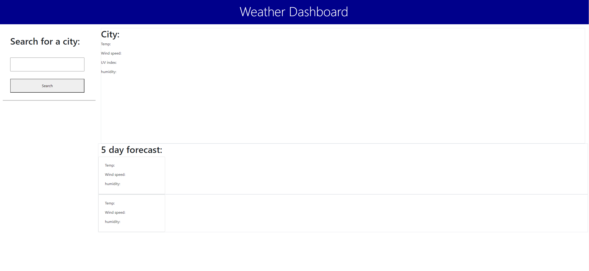
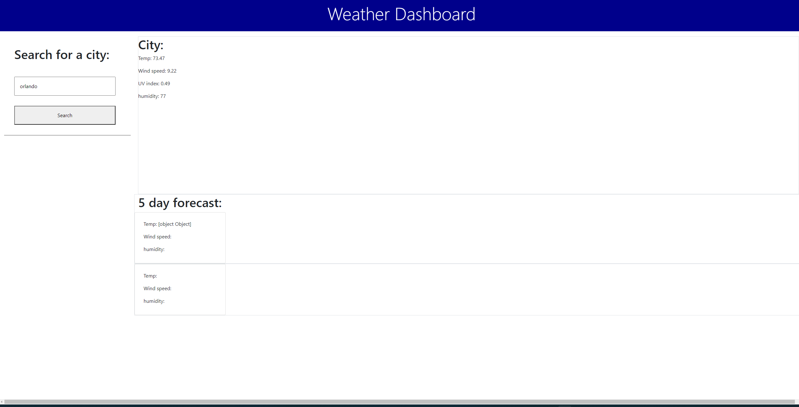

# Weather-server-side-API

Live site: https://phillip48.github.io/Weather-server-side-API/
## Project Misson 
The goal of this website is to allow the user to input any city in the world and get the weather of that city. The search history of the user is also stored under the input box in a form of a button allowing the user to go back and look at that city again. This is done user a weather API. When you search for a city a city a request is done pulling the data from a server about that city. This project uses many functions to allow the website to work well.

Screenshot 1:

Screenshot 2:
